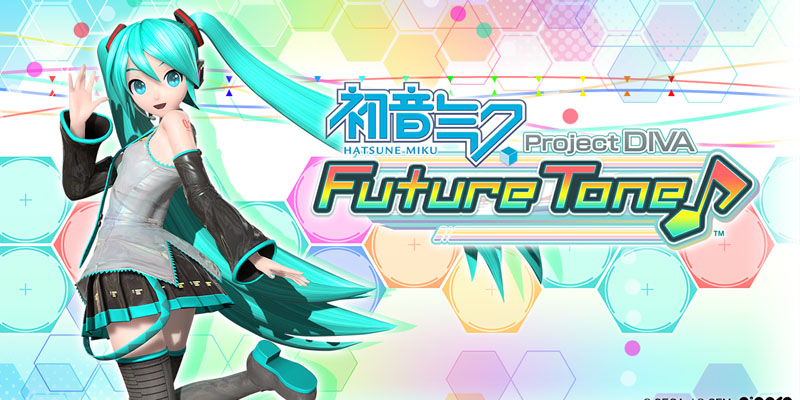

## Game Information

**Release Date:** 10th Jan 2017

**Platform:** Playstation 4

Bought both Future Sound and Colorful Tone, but not the Encore Packs.

## YouTube Playlist
I decided to stream while playing the songs on Hard, hence they are lumped together in parts rather than having one song per video.

https://www.youtube.com/playlist?list=PL4SqdMtkmSGvg0M03jiTCKLyvhuH5IL-H

<iframe width="560" height="315" src="https://www.youtube-nocookie.com/embed/videoseries?list=PL4SqdMtkmSGvg0M03jiTCKLyvhuH5IL-H" title="YouTube video player" frameBorder="0" allow="accelerometer; autoplay; clipboard-write; encrypted-media; gyroscope; picture-in-picture" allowFullScreen></iframe>

## Song List
All songs are played in Hard difficulty.

There's no Part 1 - 5 as Part 1 - 4 were in Normal difficulty, while Part 5 got blocked due to copyright.

### Part 6
- AFTER BURNER
- Aikotoba
- Akatsuki Arrival
- Arifureta Sekai Seifuku
- Ashes to Ashes
- Betty The Liar
- Beware of the Miku Miku Germs
- Black Gold
- Black Rock Shooter
- Blackjack
- break;down
- Break It, Break It!
- Butterfly on Your Right Shoulder
- Butterfly on Your Right Shoulder -39's Giving Day Edition-
- Cantarella

### Part 7
- Cat Food
- Change Me
- Close and Open, Demons and The Dead
- Clover Club
- Continuing Dream

### Part 8
- Dance of Many
- Dear
- Dear cocoa girls
- Decorator
- Deep Sea City Underground
- Deep Sea Girl
- Denparadigm
- Disruptive Diva
- Double Lariat
- Doubleganger
- Dream-Eating Monochrome Baku
- Dreaming Leaf
- DYE

### Part 9
- Electric Angel
- Electrosaturator
- Envy Cat Walk
- Equation+**
- Erase or Zero
- Far Away
- Finder (DSLR remix - re:edit)
- Fire Flower
- Francisca
- Freely Tomorrow
- from Y to Y
- Gemini
- Gigantic Girl
- Gizmo
- Glasses
- Glory 3usi9

### Part 10
- God-Tier Tune
- Gothic and Loneliness ~I'm the very DIVA~
- Grumpy Waltz
- Hanamai Tsukuyomi Tan
- Hello, Worker
- *Hello, Planet.
- Here Comes Karakasa-san
- High School Days - DIVA EDIT
- Hm? Ah, Yes.
- Holy Star -2010 DIVA mix-
- How'd It Get To Be Like This?
- I'll Miku-Miku You (For Reals)
- I'm Your Diva
- I Really Do Understand
- Idol Radio (Game Edit)
- Ievan Polkka

### Part 11
- Innocence
- Interviewer
- Iroha Uta
- Iya Iya Seijin
- Jaded
- Jugemu Sequencer
- Just Be Friends
- Karakuri Pierrot
- Kimi Ni
- Kipple Industry, Inc.

### Part 12
- Knife
- Knight of Light
- Kokoro
- Last Night, Good Night
- Leia
- Let Me Lose Myself in The Black Note
- LIKE THE WIND

### Part 13
- Look This Way, Baby
- Love-Colored Ward
- Love-Hate
- Love is War
- Love's note
- Lover's Suicide Oblivion
- Lucid Dreaming
- Luka Luka Night Fever
- Magical Sound Shower
- Magnet
- maigo life
- Marginal
- Master of Puppets
- Meiteki Cybernetics
- Melancholic

### Part 14
- Mellow Yellow
- melody...
- Melt
- Meteor
- Miracle Paint
- Monochrome Blue Sky
- moon
- Mousou Sketch
- Negaposi Continues
- NekoMimi Archive
- NekoMimi Switch
- Nice To Meet You, Mr. Earthling
- Nightmare Party Night
- No Logic
- Nostalogic (MEIKO-SAN mix)

### Part 15
- Now Choose
- Nyanyanyanyanyanyanya!
- Odds & Ends
- Oha-Yo-del!!
- On The Rocks
- One-Sided Love Samba
- Out of Eden

### Part 16
- Packaged
- Palette
- Pane dhiria
- Paradichlorobenzene
- Paris Cinema Girl
- Perico Space Shipper
- PIANO*GIRL
- Pink Moon
- Pinky Swear
- Po Pi Po
- Promise
- Puzzle

### Part 17
- Quartet of Multiple Futures -Quartet Theme-
- Rain With A Chance of Sweet*Drops
- Remote Controller
- Requiem for the Phantasma
- Rin-chan Now!
- RinRin Signal -Append Mix-
- Rolling Girl
- Romeo and Cinderella
- Rosary Pale
- Roshin Yukai
- Sadistic.Music Factory

### Part 18
- Saihate
- Sakura no Ame
- Sayonara, Goodbye
- Secret Police
- Sekiranun Graffiti

### Part 18-2
- Senbonzakura
- Senbonzakura -F edition-
- SING&SMILE
- slump

### Part 19
- Snowman
- So Much Loving You -DIVA Edit-
- Soiyassa!!
- Solitude's End
- Solitude's End -extend edition-
- Sound of Eternity -DIVAMIX-
- Song of Life
- Sound
- Soundless Voice
- SPiCa -39's Giving Day Edition-
- Star Story
- Stardust Utopia
- Starduster
- StargazeR

### Part 20
- Starlite Lydian
- Stay with me
- Step Forward
- Strobe Nights
- Summer Idol
- Sweet Devil
- Sweet Magic
- SYMPHONIC DIVE -DIVA FT edit-
- Systematic Love
- Tell Your World
- Tengaku
- Terekakushi Shishunki

### Part 21
- That One Second in Slow Motion
- The Disappearance of Hatsune Miku
- The First Sound

### Part 22
- The Intense Voice of Hatsune Miku
- The MMORPG Addict's Anthem
- The secret garden
- The Snow White Princess is...
- The Star Maker
- The Two of Us - Futaride
- The World is Mine
- This is the Happiness and Peace of Mind Committee
- Though My Song Has No Form
- Thousand Year Solo (DIVA Edit)
- Time Limit
- Time Machine
- To the End of Infinity
- Tokyo Teddy Bear

### Part 23
- Torinokocity
- Transparent Watercolors
- Travel to The Other Side of The Moon
- Tricolore Airline
- Two Breaths Walking
- Two-Sided Lovers
- Unhappy Refrain
- Updating My Love List?
- Velvet Arabesque
- VOC@LOID in Love
- VOiCE -DIVA MIX-
- Weekender Girl
- What Do You Mean!?
- When First Love Ends

### Part 24
- White Dove
- Wintry Winds
- Wolf Girl
- World's End Dance Hall -Live Dance Edition-
- World's End Umbrella
- Yellow
- Yumeyume
- ZIGG-ZAGG
- 1/6 -out of the gravity-
- 2D Dream Fever
- 39

## Blocked Songs

### Part 5
- A Song of Wastelands, Forests, and Magic
- Absolunote
- ACUTE

### Part 7
- Colorful x Melody
- Colorful x Sexy