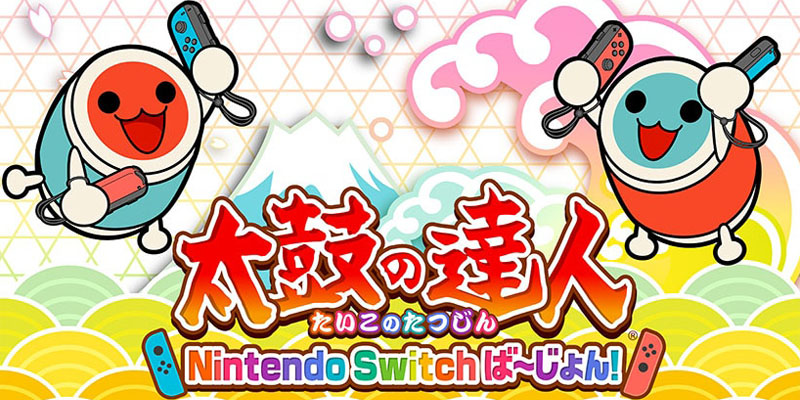

## Game Information

**Release Date:** 19th Jul 2018

**Platform:** Nintendo Switch

## YouTube Playlist

This playlist will be updated randomly. Will contain recordings of me playing either with IINE Tatacon or just a normal controller.

https://www.youtube.com/playlist?list=PLEkMaEefgshB8yhZZvc5iOu-I7GPctaRm

<iframe width="560" height="315" src="https://www.youtube-nocookie.com/embed/videoseries?list=PLEkMaEefgshB8yhZZvc5iOu-I7GPctaRm" title="YouTube video player" frameBorder="0" allow="accelerometer; autoplay; clipboard-write; encrypted-media; gyroscope; picture-in-picture" allowFullScreen></iframe>

## Song List
All songs are played in Normal difficulty.

- [VOCALOID Music][DLC] Alien Alien
- [VOCALOID Music][DLC] I want to be your heart
- [VOCALOID Music][DLC] Hibana
- [VOCALOID Music][DLC] World is Mine
- [VOCALOID Music][DLC] Buriki no Dance
- [VOCALOID Music][DLC] Karamari no Hana
- [VOCALOID Music][DLC] Streaming Heart
- [VOCALOID Music][DLC] 1, 2 Fanclub
- [VOCALOID Music][DLC] Jumenso - Colorful Version
- [VOCALOID Music] Haikei Doppelganger
- [VOCALOID Music] EDY -Electrical Dancing Yoga-
- [VOCALOID Music] Onigiri Wa Dokokashira
- [Variety] Bad Apple !!
- [Variety] Grip & Break down !!