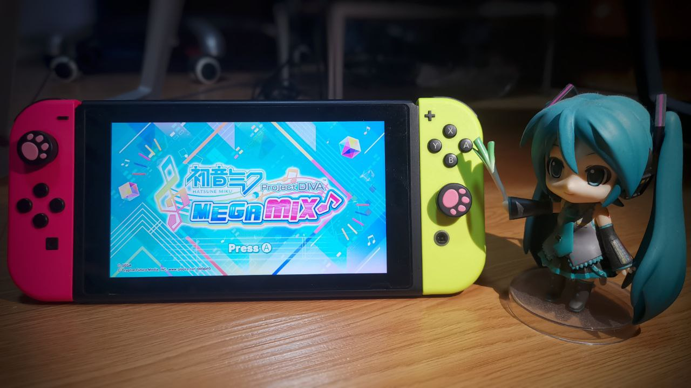
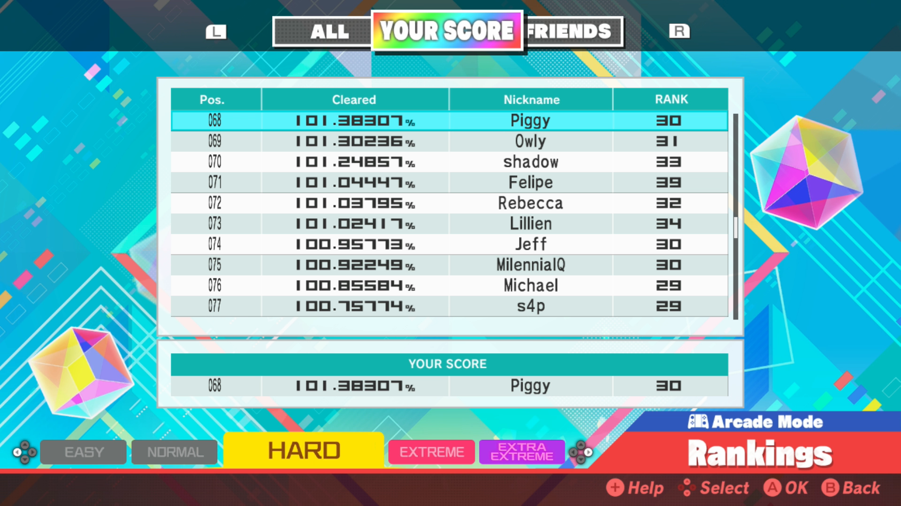
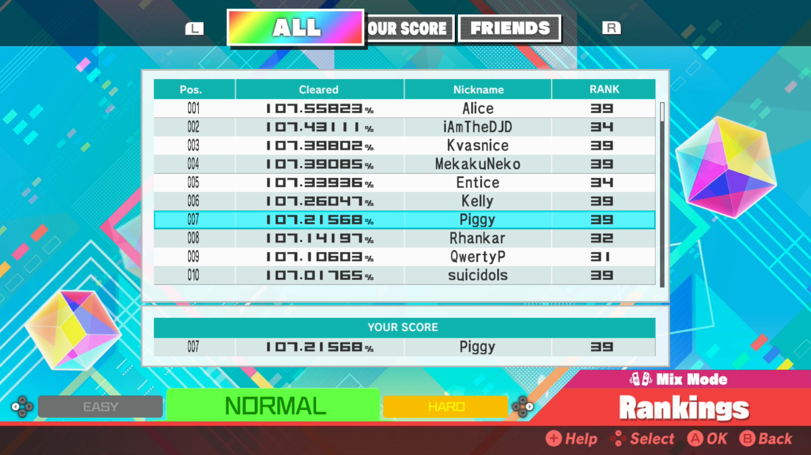

## Game Information

**Release Date:** May 15th 2020

**Platform:** Nintendo Switch

**Playthough Status**: Completed (31 July 2020)

## Introduction

I recorded all my playthroughs of **Arcade Mode (Hard)** and **Mix Mode (Normal)** while achieving an online rank for all songs (i.e. minimum top 500 scores per song).

For Mix Mode, I also aimed to get Perfect grade for all songs.

## Arcade Mode
My overall ranking: **68th** (as of 28th June 2020)

Note: I'm playing with Playstation controller icons (Triangle/Circle/Square/X) instead of Switch controller icons because I'm just too used to the former's icons for Project DIVA games.

## Mix Mode
My overall ranking: **7th** (as of 31st July 2020)

Click [HERE](pdmm-mix-list) to jump to Mix Mode list.

## Rank Information
- Online ranking for Arcade Mode (Hard) and Mix Mode (Normal) only records the top 500 scores
- Date refers to the date of the screenshot taken, and will not be updated
- Due to the possible fluctuating high scores, it is highly likely that the ranks recorded here will be outdated